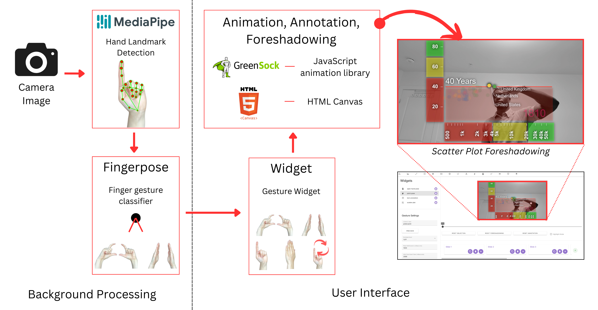
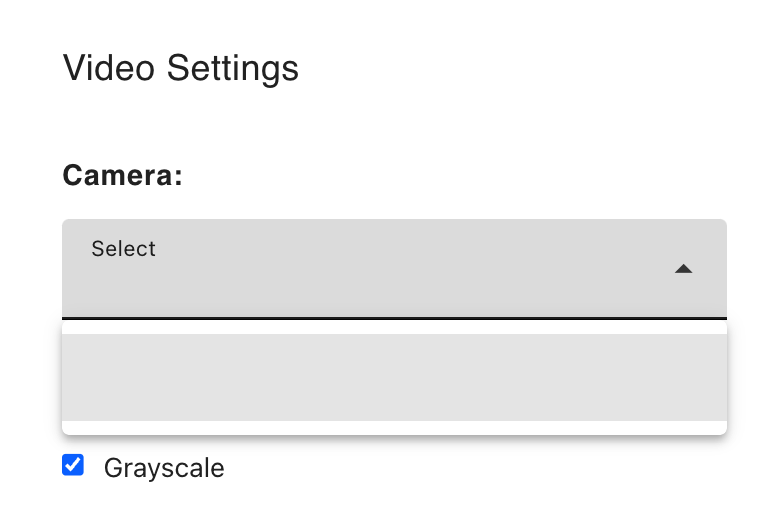

# VisConductor

VisConductor is a tool that enables presenters to configure hand gestures for controlling dynamic data visualizations during remote presentations. Details about the system can be found in the following publication:

> Temiloluwa Femi-Gege, Matthew Brehmer, Jian Zhao.
> [VisConductor: Affect-Varying Widgets for Animated Data Storytelling in Gesture-Aware Augmented Video Presentation.](https://arxiv.org/abs/2406.17986)

A video demo of VisConductor can be viewed [here](https://www.youtube.com/watch?v=kdmB3Sh-uq8)

This repository contains the VisConductor application source code. 



The application is built using Vue.js, with the presenter’s webcam feed processed in real-time using MediaPipe, which tracks hand and finger positions. These positions are then analyzed by Fingerpose to recognize predefined static and dynamic gestures, such as pointing, framing, and dialling. These gestures are mapped to corresponding Gesture Widgets in the system, which are used to control animations, highlight specific data points, and trigger annotations in the presentation.

Once a gesture is recognized, it activates animations or visual effects within the linked Chart Widgets or Annotation Widgets. These animations, such as data transitions or annotation reveals, are handled by GreenSock (GSAP), ensuring smooth and responsive interactions. 

## Getting Started

### Install required packages
```sh
yarn install
```
### Starting the dev server

```sh
yarn run dev
```

> ⚠️ Once the application is running, you may need to grant webcam access under your browsers settings. Otherwise the list of cameras under the camera widget will be empty. 

### Test datasets
> ⚠️ Be careful not to use large datasets as they won't work. But feel free to use the provided datasets in the repo to get started.

To access sample datasets, use the datasets in the folder `src/utils/lib/data` folder.
- To configure the `gapminder_200y.json` chart. First add a new slide, then click on the scatter plot widget. After you paste the data JSON data into the form, use the following settings for the rest of the application:
     - *Keyframe Field*: `year`
     - *Unique Key Field*: `country`
     - *X Field*: `gdp_pcap`
     - *X Axis Scale*: `scaleLinear` | `scaleLog`
     - *Y Field*: `life_expectancy`
     - *Y Axis Scale*: `scaleLinear`
     - *Size Field (Can be left blank)*: `population` | `undefined`
     - *Color Field (Defaults to the unique key field if left blank)*: `continent` | `country` | `undefined`
     - *Selection Field (Defaults to the unique key field if left blank)*: `continent` | `country` | `undefined`

- To configure the `bar-chart-race.json` chart. First add a new slide, then click on the bar chart widget. After you paste the data JSON data into the form, use the following settings for the rest of the application:
     - *Keyframe Field*: `date`
     - *Unique Key Field*: `location`
     - *X Field*: `deaths_per_100k`
     - *X Axis Scale*: `scaleLinear` | `scaleLog`
     - *Y Field (disregarded in the app but still enter anything here)*: `location`
     - *Y Axis Scale (disregarded in the app but still enter anything here)*: `scaleLinear`
     - *Color Field (Defaults to the unique key field if left blank)*: `location`
     - *Selection Field (Defaults to the unique key field if left blank)*: `location`

## Code Structure
The code is organized as such:
- `src` The main application folder.
- `src/state` This is where most of the applications reactive state & methods that modify the state are organized. 
- `src/components` This is where the app components are stored
- `src/utils` This is where the utility functions and constants are stored.

